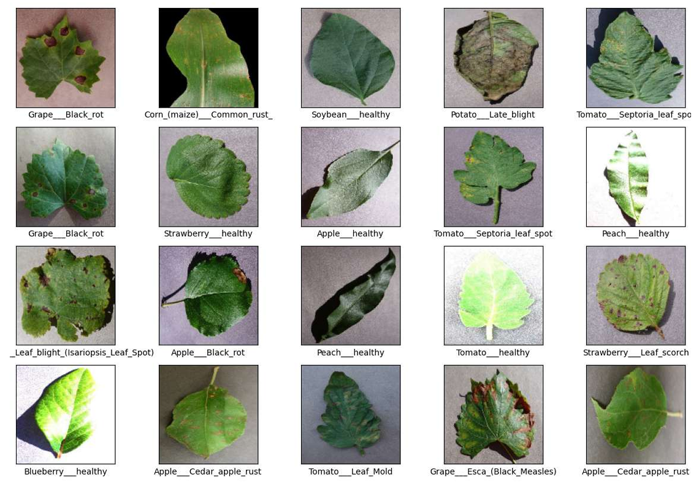
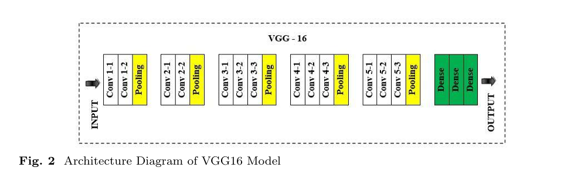
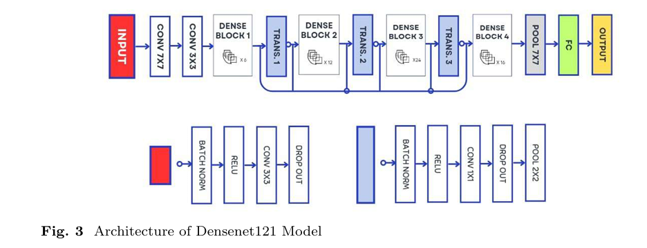
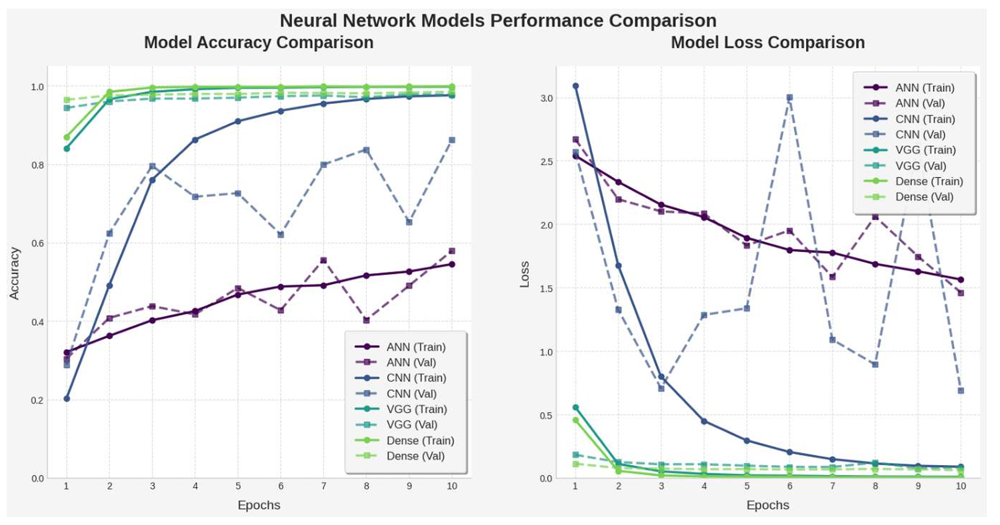

# Research Gaps and Contribution of This Study

## Research Gaps
While deep learning has been extensively explored for plant disease detection, several gaps remain:

- Few studies directly compare ANN, CNN, VGG16, and DenseNet under the same conditions, including dataset, preprocessing, and training parameters.
- The impact of transfer learning on model accuracy and generalization in plant disease classification is not fully understood. The model is not tested on large unseen data after training.
- Computational efficiency remains a challenge, as most research focuses on highly complex architectures that demand significant computing power.

## Contributions of This Study
This study makes the following contributions:

- We compare four deep learning models (ANN, CNN, VGG16, and DenseNet121) using the same dataset and training conditions for a fair evaluation.
- We analyze how transfer learning influences classification accuracy and generalization. Also testing it on 17,572 unseen images to check generalization.
- We enhance computational efficiency by training using a lowered learning rate and limiting it to ten epochs.

By addressing these gaps, this study aims to provide practical insights for developing accurate and efficient deep learning models for plant disease detection and other similar tasks in the real world.

---

# Methodology

## Dataset Description
This study uses the Kaggle New Plant Diseases Dataset, which contains 87,867 RGB images of plant leaves, both healthy and affected by various diseases. This dataset has images of 14 plants with 26 diseases, covering 38 categories, including bacterial, fungal, and viral infections, with each image labeled accordingly.

The dataset is divided into three sets:

- **Training Set**: 80% of the training directory, used to train the models.
- **Validation Set**: 20% of the training directory, used to assess model performance during training and fine-tune parameters.
- **Test Set**: A separate set containing 17,572 images, used for final evaluation to measure model generalization.

The dataset used in this study is from Kaggle, which is already augmented.

## Data Preprocessing
Before training, the dataset was preprocessed as follows:

- **Normalization**: Pixel values were scaled to the range [0, 1] by dividing each value by 255.
- **Data Augmentation**: No additional augmentation was performed, as the dataset already included augmentation.

## Model Descriptions
Four deep learning models were used:

### Artificial Neural Network (ANN)
The ANN is a fully connected architecture designed to learn high-level features.

- **Input Layer**: 256×256×3 RGB images, flattened into a 1D vector.
- **Hidden Layers**:
  - 512 neurons, ReLU activation, BatchNormalization, Dropout (0.2).
  - 256 neurons, ReLU activation, BatchNormalization, Dropout (0.2).
- **Output Layer**: 38 neurons, Softmax activation.

### Convolutional Neural Network (CNN)
The CNN is designed to learn spatial features.

- **Input Layer**: 256×256×3 RGB images.
- **Convolutional Layers**:
  - 32 filters (3×3), ReLU, BatchNormalization, MaxPooling2D (2×2).
  - 64 filters (3×3), ReLU, BatchNormalization, MaxPooling2D (2×2).
  - 128 filters (3×3), ReLU, BatchNormalization, MaxPooling2D (2×2).
- **Flatten Layer**: Converts multi-dimensional output to a 1D vector.
- **Fully Connected Layers**:
  - 128 neurons, ReLU.
  - 64 neurons, ReLU.
  - 38 neurons, Softmax.

### VGG16 (Transfer Learning)
VGG16 is a pre-trained CNN on ImageNet. The first four convolutional blocks (conv1 to conv4) were frozen. The last convolutional block (conv5) and the fully connected layers were fine-tuned. The input is 256×256 RGB images, and the output layer uses Softmax activation for 38 classes.

### DenseNet121 (Transfer Learning)
DenseNet121 is a pre-trained CNN on ImageNet. Only the final fully connected layers were fine-tuned. The convolutional layers, including Conv5, were frozen. The input is 256×256 RGB images, and the output layer uses Softmax activation for 38 classes.

## Training Configuration

- **Batch Size**: 32
- **Optimizer**: Adam (learning rate: 0.00001)
- **Loss Function**: Categorical Cross-Entropy
- **Epochs**: 10
- **Hardware**: GPU

## Evaluation Metrics

- Accuracy
- Loss (Categorical Cross-Entropy)
- Precision, Recall, F1-Score (average of all classes)

---

# Results

## Performance of the Models
The models were evaluated based on their accuracy, loss, and generalization capabilities using the validation set. All models were trained for five epochs using the default learning rate, and their performance was compared across the following metrics:

### Training and Validation Metrics

| Model       | Training Accuracy (%) | Validation Accuracy (%) | Training Loss | Validation Loss |
|------------|----------------------|------------------------|---------------|----------------|
| ANN        | 53.85                | 57.91                  | 1.5893        | 1.4615         |
| CNN        | 97.57                | 86.20                  | 0.0867        | 0.6891         |
| VGG16      | 99.78                | 97.75                  | 0.0075        | 0.0814         |
| DenseNet121| 99.87                | 98.46                  | 0.0043        | 0.0593         |

### Testing Metrics

| Model       | Accuracy (%) | Precision | Recall | F1-score |
|------------|-------------|-----------|--------|----------|
| ANN        | 57          | 0.62      | 0.57   | 0.57     |
| CNN        | 86          | 0.88      | 0.86   | 0.86     |
| VGG16      | 98          | 0.98      | 0.98   | 0.98     |
| DenseNet121| 98          | 0.98      | 0.98   | 0.98     |

---

# Conclusion
This study evaluated the performance of four deep learning models—ANN, CNN, VGG16, and DenseNet121—for plant disease classification using the Kaggle New Plant Disease Dataset. The models were compared in terms of accuracy, loss, and generalization capabilities.

VGG16 emerged as the best-performing model, achieving the highest validation and testing accuracy, largely due to its deep architecture and use of transfer learning. DenseNet121 also performed exceptionally well, benefiting from feature reuse but slightly lagging behind VGG16. CNN demonstrated strong performance, indicating that convolutional networks can effectively learn plant disease features. ANN performed the weakest, highlighting the limitations of fully connected networks in image classification tasks.

Future work should explore higher-resolution images, advanced data augmentation techniques, and other deep learning approaches to further enhance model performance. Overall, this study demonstrates the effectiveness of deep learning models in plant disease classification and emphasizes the trade-offs between model complexity, computational efficiency, and classification accuracy.
